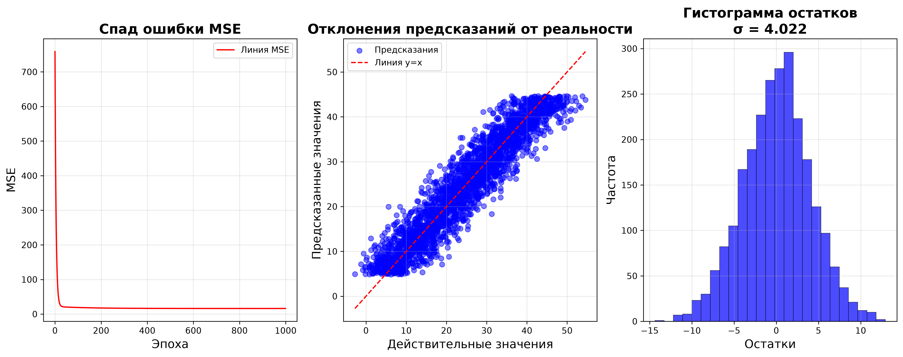

# Линейная регрессия с одним признаком

[](https://www.python.org/)
[](https://numpy.org/)
[](https://matplotlib.org/)
[](https://github.com/)

Реализация **линейной регрессии с одним признаком** с нуля на **NumPy** с использованием **градиентного спуска**.

---

## 📋 Описание проекта

Проект демонстрирует полный цикл создания модели машинного обучения:

- 🧮 **Генерация синтетических данных** с заданным уровнем шума
- 📐 **Реализация линейной регрессии** с нуля (без sklearn)
- ⚡ **Градиентный спуск** для оптимизации весов
- 📊 **Визуализация результатов** (3 информативных графика)
- 🔍 **Оценка качества** на тренировочной и тестовой выборках

---

## 🛠️ Технологии

| Технология | Версия | Назначение |
|------------|--------|------------|
| **Python** | 3.12+ | Язык программирования |
| **NumPy** | 1.24+ | Математические вычисления |
| **Matplotlib** | 3.7+ | Визуализация данных |
| **scikit-learn** | 1.2+ | Разделение данных (train_test_split) |

---

## 🚀 Установка и запуск

### Вариант 1: Использование UV (рекомендуется)

**UV** — это быстрый менеджер пакетов. Автор проекта использовал его.

#### 1. Установка UV (если не установлен)

**Windows (PowerShell):**
```powershell
powershell -c "irm https://astral.sh/uv/install.ps1 | iex"
```

**Mac/Linux:**
```bash
curl -LsSf https://astral.sh/uv/install.sh | sh

# Или через pip
pip install uv
```

#### 2. Клонирование и установка

```bash
git clone https://github.com/ZazuXP/one-feature-regression.git
cd one-feature-regression

# Установка всех зависимостей
uv sync

# Или через pip (если uv уже установлен)
uv pip install -e .
```

#### 3. Запуск

```bash
uv run python main.py
```

### Вариант 2: Использование стандартного venv

#### 1. Клонирование репозитория

```bash
git clone https://github.com/ZazuXP/one-feature-regression.git
cd one-feature-regression
```

#### 2. Создание виртуального окружения

**Windows:**
```bash
python -m venv .venv
.venv\Scripts\activate
```

**Mac/Linux:**
```bash
python3 -m venv .venv
source .venv/bin/activate
```

#### 3. Установка зависимостей

```bash
# Установка из pyproject.toml
pip install -e .

# Или через requirements.txt (если есть)
pip install -r requirements.txt

# Или вручную
pip install numpy>=1.24.0 matplotlib>=3.7.0 scikit-learn>=1.2.0
```

#### 4. Запуск

```bash
python main.py
```

---

## 🧠 Как это работает

### 1. Генерация данных

- 🎲 **Воспроизводимость** — используется seed=42 для фиксации случайности

- 📊 **Гибкость** — можно менять количество точек, уровень шума, коэффициенты

- 🔄 **Разделение** — данные автоматически делятся на обучающую (80%) и тестовую (20%) выборки

### 2. Обучение модели (Градиентный спуск)

**Ключевые компоненты**:

- Функция потерь (MSE) оценивает качество предсказаний
- Градиенты показывают, как изменить вес и смещение
- Learning Rate контролирует размер шага 
- Информативные сообщения об ошибках

### 3. Визуализация и оценка результатов

На финальном этапе строятся **три графика и вычисляются метрики качества**.

**Графики**:
- Спад ошибки MSE
- Предсказание vs Реальность
- Гистограмма остатков

---

## 💡 Обоснование

1. **Градиентный спуск** гарантирует нахождение минимума для выпуклых функций (MSE — выпуклая)

2. **Learning rate** контролирует скорость сходимости

3. Разделение на **train/test** предотвращает переобучение

4. Визуализация позволяет **диагностировать проблемы**

---

## 📊 Результаты

Модель обучалась на **2500 точках с уровнем шума σ = 4**. Истинная зависимость: **y=2x+5**

### Параметры модели

| Параметр | Истинное значение | Выученное значение | Погрешность |
|----------|-------------------|--------------------|-------------|
| **Вес (w1)** | 2.0000 | 1.9899 | 0.505% |
| **Смещение (w0)** | 5.0000 | 4.8555 | 2.89% |

### Качество модели

| Метрика | Значение | 
|---------|----------|
| **MSE (обучение)** | 16.1368 |
| **MSE (тест)** | 16.3498 |

### Визуализация



**Три графика: спад ошибки MSE, предсказание vs реальность, гистограмма остатков**

---

## 👨‍💻 Автор

**ZazuXP** 
[GitHub](https://github.com/ZazuXP)

---

## 📄 Лицензия

Проект распространяется под **лицензией MIT**.

---

## 📬 Вопросы и предложения

Если у вас возникли вопросы или идеи по улучшению — создавайте Issue или Pull Request на GitHub. **Буду рад обратной связи!**